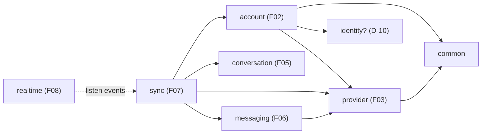

# F01 — Project Foundation · Technical Design

> Mode: **TRAINING** — Human implement, AI mentor/review/test. Mọi mục **Decision Needed** thuộc về Human; mục **Proposed default** áp dụng nếu Human không phản đối khi review.
> Trạng thái: DRAFT chờ Human review. Không implement trước `APPROVED TO IMPLEMENT`.

## Context

### Ánh xạ sang Notion

Bộ Technical Spec F01–F03 (trang **04D**) được chia theo change để mỗi feature có vòng đời riêng (propose → implement → archive):

| 04D section | Nằm ở |
|---|---|
| 1 Repository Baseline, 2 Module Architecture, 3 Configuration & Profiles, 4 Database & Flyway, 8 Error Model, 10 Transactions & Events (convention), 11 Testing, 12 Observability, 13 Local Commands, 14 DoD F01 | file này |
| 5 F02 Domain Model, 7 API (accounts), 9 Security & Credential Boundary, 10 (account events), 14 DoD F02 | `be-f02-connected-accounts/design.md` |
| 6 F03 Provider Contract, 7 API (providers), 14 DoD F03 | `be-f03-provider-contract/design.md` |

Implementation Plan (trang **04C**) = ba file `tasks.md` tương ứng. Danh sách task dùng mã `BE-xx` liên tục qua F01–F03.

### 1. Repository Baseline (inspect ngày 2026-09-30)

| Hạng mục | Thực tế |
|---|---|
| Vị trí | `D:\Code\Product\MessageHub\Sino\apps\sino-api`, monorepo `Sino/` (Git, remote `origin`) |
| Build | Maven wrapper 3.9.16 · `./mvnw test-compile` → **BUILD SUCCESS**. Test chưa chạy: Docker daemon chưa chạy |
| Runtime | Java 25 (Temurin 25.0.3), packaging jar |
| Phiên bản resolve | Spring Boot 4.1.1 · Spring Framework 7.0.9 · Spring Security 7.1.1 · Hibernate ORM 7.4.5 · Flyway 12.4.0 · **Jackson 3.1.5 (`tools.jackson`)** · **JUnit 6.0.3** · Testcontainers 2.0.5 · Spring Modulith 2.1.1 · PostgreSQL JDBC 42.7.13 · Tomcat 11.0.24 · ArchUnit 1.4.2 · jMolecules 2.0.1 |
| Starter có sẵn | webmvc, data-jpa, flyway (+`flyway-database-postgresql`), security, security-oauth2-client, validation, actuator, devtools, modulith (core, jpa, observability, actuator, runtime), test starters tương ứng, `spring-boot-testcontainers`, `testcontainers-postgresql` |
| Code | `dev.sino.SinoApiApplication`; `application.yaml` chỉ có `spring.application.name`; test: `SinoApiApplicationTests.contextLoads`, `TestcontainersConfiguration` (`postgres:latest`), `TestSinoApiApplication` |
| Chưa có | module package, migration, profile, security config, error handler, compose file, CI, README |

**Gap chính so với docs:**

| Docs yêu cầu | Code hiện tại | Hệ quả |
|---|---|---|
| Flyway quản lý schema (02B, 04A) | Không có `db/migration` | Với `spring-modulith-starter-jpa`, Hibernate `validate` sẽ fail vì thiếu bảng `event_publication` |
| Security baseline (02A §11) | Có starter, không có config | Mọi endpoint trả 401 với mật khẩu sinh ngẫu nhiên in ra log |
| Docker Compose cho PostgreSQL (02A §12, 04A) | Chỉ có Testcontainers dev-time | Chưa có DB local bền vững |
| Modulith verification test (04A §4) | Không có | Boundary chưa được kiểm tra |
| Structured error (FR-06, FR-08) | Không có | Lỗi trả mặc định của Spring |
| Pin phiên bản môi trường | `postgres:latest` | Test không tái lập được theo thời gian |

### Conflict giữa các tài liệu (đã xử lý theo thứ tự ưu tiên ở trang 04)

| ID | Conflict | Nguồn | Xử lý |
|---|---|---|---|
| C1 | Package layer-first `com.messagehub.{api,application,domain,infrastructure}` vs module-first `dev.sino.<module>.<layer>` | 02 vs 02A, 04A, code | Theo 02A/04A (khớp code). Đề nghị cập nhật trang 02 |
| C2 | Capability dạng boolean fields vs danh sách enum | 02 vs 02A | Theo 02A (chi tiết ở F03) |
| C3 | SPI thiếu/có `getAccountProfile` | 02 vs 02A | Theo 02A (F03) |
| C4 | F02 gồm "auth flow" vs "đủ để provider auth gắn vào sau" | 03 vs 04A | 04A ưu tiên cao hơn → connect/OAuth flow thuộc **F04** |
| C5 | `POST /api/accounts/connect/{provider}` vs `POST /api/accounts/{provider}/connect` | 02 vs 02A | Ngoài phạm vi F01–F03; chốt khi làm F04 |
| C6 | Tên "MessageHub" vs "Sino" | 00–02 vs code/context | Cùng một sản phẩm; code dùng Sino |
| C7 | `application.yml` vs file thực tế `application.yaml` | 04D vs code | Giữ `application.yaml` (không đổi tên file không cần thiết) |
| C8 | Thứ tự migration 02B bắt đầu `V1__create_app_user` | 02B vs nhu cầu F01 | Đánh số lại (xem §4); 02B cho phép điều chỉnh khi bắt đầu |

## Goals / Non-Goals

**Goals:**
- Ứng dụng start được ở máy dev (profile `local`) và trong test (Testcontainers) với cùng một PostgreSQL version.
- Schema do Flyway quản lý hoàn toàn; Hibernate chỉ validate.
- Module boundary được kiểm tra tự động từ ngày đầu.
- Convention chung (error model, JSON, transaction, event, test, logging) đủ rõ để F02/F03 chỉ việc áp dụng.
- Lệnh build/run/test được ghi lại và chạy được thật.

**Non-Goals:** xem mục Non-goals trong `proposal.md` (không domain nghiệp vụ, không login thật, không OAuth client registration, không realtime/scheduler, không thêm hạ tầng mới).

## Decisions

### 2. Module Architecture

```
dev.sino
├── SinoApiApplication
├── common            # technical-only, allowedDependencies = {} (không phụ thuộc business module)
│   ├── error         # @NamedInterface("error"): ErrorCode, SinoException...  → module khác dùng được
│   ├── web           # nội bộ: GlobalExceptionHandler, Jackson/web config
│   └── security      # nội bộ: SecurityFilterChain, entry point trả Problem Details
├── provider          # F03
├── account           # F02
└── (identity)        # F02, tùy Decision D-10
```

Bên trong một business module:

```
dev.sino.<module>
├── <PublicTypes>.java   # public API cho module khác: facade/service interface, DTO record, event
├── api                  # REST controller + request/response DTO (nội bộ)
├── application          # application service, use case, transaction boundary (nội bộ)
├── domain               # aggregate, value object, domain rule (nội bộ)
└── infrastructure       # JPA entity/repository, adapter, crypto... (nội bộ)
```

Hướng phụ thuộc mục tiêu (mũi tên = "phụ thuộc vào"):



- Provider **không** phụ thuộc account: `ProviderContext` nhận dữ liệu thuần (ID, credential đã giải mã) do bên gọi truyền vào.
- Giao tiếp ngược chiều (ví dụ account cần biết khi sync lỗi auth) đi qua **event**, không gọi ngược.

**Decision D-03 — Public API của module nằm ở đâu?** · **Accepted: A** (2026-10-01, Human chấp nhận đề xuất)

| Phương án | Ưu | Nhược |
|---|---|---|
| **A. Base package + `@NamedInterface` khi cần** (đề xuất) | Đúng mặc định Spring Modulith; public API nhỏ, nhìn là thấy; layer package tự động là nội bộ | Base package có thể đông type nếu module lớn → tách named interface (ví dụ `provider.spi`) |
| B. `@NamedInterface` cho cả package `application` | Giữ đúng hình dạng 4 layer của 02A | Export luôn service nội bộ; boundary lỏng |
| C. Module `OPEN` | Không phải nghĩ về export | Mất gần hết lợi ích của Modulith |

Lưu ý tên gọi: trong 02A, `api` là **REST layer** (nội bộ), không phải "module API" theo nghĩa Spring Modulith.
*Câu hỏi cho bạn:* nếu module `sync` cần đọc credential đã giải mã của một account, type nào của `account` phải là public, và type nào tuyệt đối không được public?

### 3. Configuration & Profiles

| File | Vai trò |
|---|---|
| `application.yaml` | Cấu hình chung, production-like. Secret/URL đọc từ environment, **không** có giá trị mặc định |
| `application-local.yaml` | Máy dev: `spring.config.import: optional:file:.env[.properties]`, datasource trỏ Docker Compose, log `dev.sino` ở DEBUG, expose thêm `modulith` actuator |
| `src/test/resources/application-test.yaml` | Giá trị giả cho test (user API, key test...). Test bật profile `test` |

> ⚠️ Không tạo `src/test/resources/application.yaml`: file này **che** hoàn toàn `application.yaml` của main trên classpath test.

Thuộc tính chính (`application.yaml`):

| Property | Giá trị | Lý do |
|---|---|---|
| `spring.datasource.url/username/password` | `${SINO_DB_URL}`, `${SINO_DB_USERNAME}`, `${SINO_DB_PASSWORD}` | Secret ngoài repo |
| `spring.jpa.open-in-view` | `false` | Transaction kết thúc ở application service |
| `spring.jpa.hibernate.ddl-auto` | `validate` | Flyway là nguồn schema duy nhất |
| `spring.mvc.problemdetails.enabled` | `true` | RFC 9457 cho lỗi của Spring MVC |
| `management.endpoints.web.exposure.include` | `health,info` | Tối thiểu |
| `management.endpoint.health.probes.enabled` | `true` | liveness/readiness |
| `management.endpoint.health.show-details` | `when-authorized` (chốt ở BE-06) | Ẩn danh chỉ thấy trạng thái tổng; user API thấy từng component để chẩn đoán |
| `management.endpoint.health.group.readiness.include` | `readinessState,db` | Readiness phản ánh DB |
| ~~`spring.security.user.name/password`~~ → `sino.security.api-user.username/password` | `${SINO_API_USERNAME:}` / `${SINO_API_PASSWORD:}` | D-02 A. **Đổi khi làm BE-04:** khi thiếu biến môi trường, Boot giữ nguyên chuỗi `${...}` và dùng nó làm mật khẩu (credential đoán được). Properties riêng có `@NotBlank` cùng giá trị mặc định rỗng khiến app không start khi thiếu biến |

Biến môi trường (`.env.example`, dùng chung cho Docker Compose và profile `local`):

| Biến | Dùng bởi | Ghi chú |
|---|---|---|
| `POSTGRES_DB`, `POSTGRES_USER`, `POSTGRES_PASSWORD` | compose | Chỉ cho DB local |
| `SINO_DB_URL`, `SINO_DB_USERNAME`, `SINO_DB_PASSWORD` | app | |
| `SINO_API_USERNAME`, `SINO_API_PASSWORD` | app | D-02 |
| `SINO_CREDENTIAL_*` | app (F02) | D-11 |

Custom property của Sino dùng prefix `sino.*`, bind bằng `@ConfigurationProperties` (record) + `@Validated` để fail-fast; `spring-boot-configuration-processor` đã có sẵn để sinh metadata.

**Decision D-02 — Người dùng Sino và bảo vệ API ở MVP** · **Accepted: A** (2026-10-01)

| Phương án | Mô tả | Ưu | Nhược |
|---|---|---|---|
| **A. Một user cấu hình + HTTP Basic** (đề xuất) | `spring.security.user.*` từ env; `/api/**` yêu cầu Basic; stateless, không session; health public | Đơn giản, vẫn có bảo vệ, test bằng curl/Postman dễ; thay bằng login thật sau không ảnh hưởng domain | Trình duyệt tự gửi lại Basic credential → rủi ro CSRF nếu có endpoint nhận form; phải giữ API chỉ nhận JSON |
| B. `permitAll` ở profile `local` | Không xác thực khi dev | Đơn giản nhất | Endpoint quản lý credential không được bảo vệ; dễ lỡ mang cấu hình sang môi trường khác |
| C. Login thật ngay (form login + session, hoặc OAuth2 login Google) | | Sẵn cho frontend | Lệch 04A, tốn thời gian ở giai đoạn chưa có FE |

Ghi chú cho A: CSRF protection tắt cho `/api/**` là chấp nhận được **chỉ vì** API stateless và chỉ nhận `application/json` (form HTML không gửi được JSON cross-site mà không qua CORS preflight). Khi bắt đầu tích hợp frontend (F02-FE) phải xem lại quyết định này.

Giới hạn đã biết của A với trình duyệt: SPA phải giữ mật khẩu trong JavaScript để gửi header `Authorization`, và `EventSource` (SSE, F08) **không gửi được header tùy chỉnh**. Vì vậy A chỉ là giải pháp cho giai đoạn backend-only (F01–F03). Cơ chế xác thực cho trình duyệt (ví dụ session cookie + CSRF token, hoặc OAuth2 login) là quyết định **D-22**, phải chốt khi bắt đầu Phase 1 (frontend nền) — xem `openspec/roadmap.md`.
*Câu hỏi cho bạn:* vì sao "stateless + chỉ nhận JSON" lại làm giảm rủi ro CSRF, và điều gì sẽ phá vỡ lập luận đó?

**D-23 — JVM chạy ở UTC** · *Accepted (Human chọn phương án A, 2026-09-30, phát sinh khi làm BE-01)*: trên Windows đặt vùng Việt Nam, múi giờ mặc định của JVM là tên cũ `Asia/Saigon`. PostgreSQL JDBC driver gửi múi giờ của JVM lên server khi kết nối, còn image `postgres:18` (Debian 13, không có `tzdata-legacy`) không biết tên này nên từ chối kết nối (`FATAL: invalid value for parameter "TimeZone"`). Cách xử lý: `SinoApiApplication.main` đặt `TimeZone.setDefault(UTC)` (phủ mọi cách chạy app đi qua `main`: IntelliJ, `java -jar`, `spring-boot:run`, `spring-boot:test-run`), và `pom.xml` đặt property `argLine=-Duser.timezone=UTC` cho JVM test của Surefire (`@SpringBootTest` không gọi `main`). Hệ quả: log hiển thị giờ UTC (`...Z`); chuyển sang giờ địa phương là việc của tầng hiển thị. Hai phương án không chọn: B (JVM dùng `Asia/Ho_Chi_Minh`: server gắn với một địa phương) và C (image có `tzdata-legacy`: chữa triệu chứng, phải duy trì image riêng).

**D-05 — Cách chạy DB local** · *Proposed default*: Docker Compose chạy tay (`docker compose up -d`) cho DB bền vững; giữ `TestSinoApiApplication` (`./mvnw spring-boot:test-run`) cho lần chạy nhanh với DB tạm. Không thêm `spring-boot-docker-compose` (ít "magic", không thêm dependency). File `compose.yaml` đặt trong `apps/sino-api` vì chỉ backend dùng.

### 4. Database & Flyway

- Vị trí: `apps/sino-api/src/main/resources/db/migration`.
- Tên file: `V{n}__{module}_{mô_tả}.sql` — ví dụ `V1__modulith_create_event_publication.sql`, `V3__account_create_connected_account.sql`. Version tăng dần, một thư mục cho mọi module (Flyway chỉ có một lịch sử).
- Quy tắc: migration đã merge thì **không sửa**; muốn đổi thì thêm migration mới. Mỗi migration nhỏ, một mục đích. Test context load (`ddl-auto=validate`) là lưới an toàn cho mapping.
- Kiểu dữ liệu: khóa chính `uuid`; thời điểm `timestamptz`; chuỗi có giới hạn dùng `varchar(n)`, nội dung dài dùng `text`; `jsonb` chỉ cho metadata khó chuẩn hóa (02B §1).
- Cột audit chuẩn cho bảng nghiệp vụ: `created_at timestamptz not null`, `updated_at timestamptz not null`; bảng có cập nhật đồng thời thêm `version bigint not null` (optimistic locking).

Kế hoạch version F01–F03 (thay cho thứ tự V1–V9 của 02B, xem C8):

| Version | Module | Nội dung | Feature |
|---|---|---|---|
| V1 | modulith | `event_publication` | F01 |
| V2 | identity/account (D-10) | `app_user` | F02 |
| V3 | account | `connected_account` | F02 |
| V4 | account | `account_credential` | F02 |
| V5+ | conversation, messaging, sync | theo 02B | F05+ |

Bảng `event_publication` (đối chiếu từ mã nguồn `spring-modulith-events-jpa` 2.1.1, entity `DefaultJpaEventPublication`):

| Cột | Kiểu đề xuất | Ràng buộc |
|---|---|---|
| `id` | `uuid` | PK |
| `publication_date` | `timestamptz` | not null |
| `listener_id` | `text` | not null |
| `event_type` | `text` | not null |
| `serialized_event` | `text` | not null (event có thể dài hơn 255 ký tự → không dùng varchar(255)) |
| `completion_date` | `timestamptz` | null |
| `last_resubmission_date` | `timestamptz` | null |
| `completion_attempts` | `integer` | not null, default 0 |
| `status` | `varchar(20)` | null (enum dạng chuỗi) |

Index gợi ý: `completion_date` (tìm publication chưa hoàn tất). Bảng `event_publication_archive` **không** cần trừ khi bật `spring.modulith.events.completion-mode=archive`.

**D-04 — Giữ Event Publication Registry (JPA) từ F01** · *Proposed default*: giữ `spring-modulith-starter-jpa` và tạo V1. Lý do: F02 publish event (`AccountConnected`...) và F07 cần listener tin cậy (event được lưu cùng transaction, không mất khi crash). Phương án khác: gỡ starter-jpa tới F07 — ít bảng hơn nhưng phải đổi `pom.xml` hai lần và event F02 không có đảm bảo.

**D-06 — Phiên bản PostgreSQL** · *Proposed default*: `postgres:18` (major ổn định hiện tại; Flyway 12 hỗ trợ). Cùng tag cho `compose.yaml` và `TestcontainersConfiguration`. Nếu Flyway báo version chưa hỗ trợ thì hạ xuống `postgres:17` và ghi lại lý do.

**D-08 — Sinh UUID** · *Proposed default*: sinh ở ứng dụng bằng Hibernate `@UuidGenerator(style = VERSION_7)` (đã kiểm tra enum `UuidGenerator.Style.VERSION_7` có trong Hibernate 7.4.5). UUIDv7 tăng theo thời gian → index B-tree ít phân mảnh hơn UUIDv4. Phương án khác: default phía DB (`gen_random_uuid()` hoặc `uuidv7()` của PostgreSQL 18) — ID chỉ có sau khi insert, khó dùng trong domain event trước khi flush.

**D-09 — Lưu enum** · *Proposed default*: `varchar` + `@Enumerated(EnumType.STRING)` + `CHECK (col IN (...))` trong migration. Không dùng PostgreSQL enum type (khó thêm/bớt giá trị qua migration). Trade-off: thêm giá trị enum mới cần migration sửa CHECK — chấp nhận được, vì đó chính là lúc nên nghĩ lại dữ liệu cũ.

### 8. Error Model

Response lỗi (RFC 9457, `Content-Type: application/problem+json`):

```json
{
  "title": "Bad Request",
  "status": 400,
  "detail": "Request validation failed",
  "instance": "/api/accounts/7c1e.../",
  "code": "VALIDATION_FAILED",
  "errors": [ { "field": "displayName", "message": "must not be blank" } ]
}
```

- `code` là khóa ổn định cho frontend; `title`/`detail` chỉ để người đọc.
- ~~`type` để `about:blank`~~ → `type` **không xuất hiện** trong response. **LÝ DO (phát hiện ở BE-05):** từ Spring Framework 7, `ProblemDetail.type` mặc định là `null` và bị bỏ qua khi serialize; theo RFC 9457 §3.1.1, thiếu `type` nghĩa là `about:blank`. Frontend dựa vào `code`.

**D-21 — Cách domain báo lỗi** · **Accepted (mặc định, làm ở BE-05)**: `common.error` export một interface `ErrorCode` (`code()`, `category()`) và exception gốc `SinoException(ErrorCode, message)`. Mỗi module định nghĩa enum code riêng implement `ErrorCode` (ví dụ `AccountErrorCode.ACCOUNT_NOT_FOUND`). `GlobalExceptionHandler` (trong `common.web`, kế thừa `ResponseEntityExceptionHandler`) map **category → HTTP status**, nên domain không biết HTTP.

| Category | HTTP |
|---|---|
| `NOT_FOUND` | 404 |
| `CONFLICT` | 409 |
| `INVALID` (vi phạm business rule) | 422 |
| `DEPENDENCY_UNAVAILABLE` | 503 |
| `RATE_LIMITED` | 429 |

Phương án khác: mỗi category một class exception (`NotFoundException`, `ConflictException`...) — dễ đọc hơn nhưng dễ bùng nổ số class, và code lỗi dễ bị quên.

**Error code catalog — F01**

| code | HTTP | Nguồn |
|---|---|---|
| `VALIDATION_FAILED` | 400 | Bean Validation (`MethodArgumentNotValidException`, `HandlerMethodValidationException`) |
| `MALFORMED_REQUEST` | 400 | JSON không parse được, sai kiểu tham số |
| `UNAUTHORIZED` | 401 | Security entry point |
| `FORBIDDEN` | 403 | Access denied handler |
| `RESOURCE_NOT_FOUND` | 404 | Không có handler / not found chung |
| `METHOD_NOT_ALLOWED` | 405 | |
| `UNSUPPORTED_MEDIA_TYPE` | 415 | |
| `CONCURRENT_MODIFICATION` | 409 | Optimistic locking fail |
| `INTERNAL_ERROR` | 500 | Exception không được map (log đầy đủ phía server) |

Lỗi Spring MVC không có trong bảng (ví dụ 406) nhận `code` bằng tên `HttpStatus` (`NOT_ACCEPTABLE`). 401/403 từ security đi qua cùng handler (`SecurityProblemHandler` chuyển cho `HandlerExceptionResolver`), nên có cùng định dạng.

F02/F03 bổ sung code của mình vào catalog trong design tương ứng.

### 10. Transactions & Events — convention chung

- `@Transactional` chỉ đặt ở **application service** (public method của use case); query dùng `@Transactional(readOnly = true)`. Controller và repository không mở transaction riêng cho nghiệp vụ.
- **Không gọi API bên ngoài (provider) trong transaction DB**: lời gọi mạng giữ connection pool và làm rollback khó hiểu. Mẫu chuẩn: gọi provider → rồi mới mở transaction để lưu kết quả.
- Event nội bộ: record bất biến, tên thì quá khứ (`AccountConnected`), payload chỉ chứa ID và dữ liệu tối thiểu, **không bao giờ chứa secret**. Event là public type của module phát ra.
- Publish bằng `ApplicationEventPublisher` bên trong transaction của application service → Event Publication Registry lưu publication cùng transaction.
- Listener ở module khác dùng `@ApplicationModuleListener` (async, transaction riêng, chạy sau commit). Listener đầu tiên xuất hiện ở F07; F02 chỉ publish và kiểm tra bằng Modulith test.

### Security baseline (phần F01 của 04D §9)

- `SecurityFilterChain` trong `common.security`: `/actuator/health/**`, `/actuator/info` public; các `/actuator/**` khác cần user API (endpoint không expose sẽ trả 404 sau khi xác thực; thêm ở BE-06); `/api/**` authenticated; còn lại `denyAll`.
- Stateless (`SessionCreationPolicy.STATELESS`), không form login, không redirect.
- 401/403 trả Problem Details (custom `AuthenticationEntryPoint` + `AccessDeniedHandler`).
- Chưa cấu hình CORS (chưa có frontend gọi API); thêm khi làm tích hợp FE.
- `spring-boot-starter-security-oauth2-client` có trên classpath nhưng không có client registration nào → không tự bật OAuth2 login. Client registration cho Gmail thuộc F04.

### 11. Testing Strategy

| Tầng | Công cụ | Context | DB | Dùng cho |
|---|---|---|---|---|
| Unit | JUnit 6 + AssertJ | không Spring | không | value object, domain rule, state machine, crypto, mapper |
| Web slice | `@WebMvcTest` + `MockMvc` (import security config) | web layer | không (mock application service) | controller, validation, error mapping, JSON contract, 401 |
| JPA slice | `@DataJpaTest` + Testcontainers | JPA + Flyway | PostgreSQL thật | mapping, unique/check constraint, query |
| Module | `@ApplicationModuleTest` | một module (+ dependency) | PostgreSQL thật | application service, transaction, event được publish |
| Architecture | `ApplicationModules.verify()` | không | không | boundary |
| Full | `@SpringBootTest` + Testcontainers | toàn bộ | PostgreSQL thật | smoke, một số luồng end-to-end |

- Một `TestcontainersConfiguration` dùng chung (`@ServiceConnection`, tag cố định D-06). Spring TestContext cache context nên các test cùng cấu hình dùng lại một container.
- Test bật profile `test` (qua `@ActiveProfiles("test")` hoặc meta-annotation dùng chung).
- **Docker Desktop phải chạy** trước khi chạy test có Testcontainers.
- Chạy tất cả bằng Surefire (`./mvnw test`/`verify`); chưa tách Failsafe cho integration test — tách khi test chậm thật sự.
- Boot 4 tách test starter theo công nghệ: kiểm tra package của `@WebMvcTest`/`@DataJpaTest` trong Boot 4 trước khi import (khác Boot 3).

### 12. Observability

- Actuator như spec `operational-health`; profile `local` expose thêm `modulith` (xem cấu trúc module lúc chạy).
- `info`: tên ứng dụng; có thể bật build info qua goal `build-info` của `spring-boot-maven-plugin` (tùy chọn).
- Log: định dạng console mặc định. Không bật `org.hibernate.orm.jdbc.bind` (log bind parameter) trong file cấu hình được commit. Type chứa secret phải override `toString()` để che giá trị (áp dụng từ F02/F03).
- Chưa có tracing backend. `spring-modulith-observability` là no-op khi không có tracer — giữ nguyên.
- Structured logging (`logging.structured.format.console`) và MDC `accountId`/`provider`: để F07/F12.

### 13. Local Development Commands

Chạy trong `apps/sino-api` (PowerShell dùng `.\mvnw.cmd`, tham số `-D...` đặt trong ngoặc kép):

| Mục đích | Lệnh |
|---|---|
| Tạo file env | `cp .env.example .env` rồi điền giá trị |
| Bật DB local | `docker compose up -d` · kiểm tra `docker compose ps` |
| Vào psql | `docker compose exec postgres psql -U sino -d sino` |
| Chạy app (DB compose) | `./mvnw spring-boot:run -Dspring-boot.run.profiles=local` |
| Chạy app (DB tạm Testcontainers) | `./mvnw spring-boot:test-run` |
| Test toàn bộ | `./mvnw test` · build đầy đủ `./mvnw verify` |
| Test boundary | `./mvnw test -Dtest=ModularityTests` |
| Health | `curl http://localhost:8080/actuator/health` |
| Gọi API | `curl -u "$SINO_API_USERNAME:$SINO_API_PASSWORD" http://localhost:8080/api/...` |
| Tắt DB (giữ dữ liệu) / xóa sạch | `docker compose down` / `docker compose down -v` |

**D-07 — CI trong F01** · *Proposed default*: có. `.github/workflows/backend-ci.yml` ở repo root, chạy khi push/PR thay đổi `apps/sino-api/**`: setup Temurin 25, cache Maven, `./mvnw -B verify` (runner Ubuntu có sẵn Docker cho Testcontainers). Chi phí thấp, bắt lỗi boundary/migration sớm. Workflow chỉ chạy được sau khi branch được push — push vẫn phải hỏi Human trước.

## Risks / Trade-offs

- [Docker Desktop chưa chạy trên máy dev] → Không có bằng chứng test. Bật Docker trước khi bắt đầu BE-02; CI (D-07) là lưới thứ hai.
- [Boot 4 kéo theo major mới: Jackson 3 (`tools.jackson`), JUnit 6, Hibernate 7, Security 7 (DSL chỉ còn lambda)] → Nhiều tutorial trên mạng vẫn là Boot 3. Luôn đối chiếu reference docs của đúng phiên bản; khi import thấy `com.fasterxml.jackson.databind` là dấu hiệu sai.
- [`src/test/resources/application.yaml` che cấu hình main] → Dùng `application-test.yaml` + profile `test`.
- [Schema `event_publication` đổi khi nâng cấp Spring Modulith] → Hibernate `validate` sẽ báo; đọc release notes của Modulith trước khi nâng version và thêm migration tương ứng.
- [HTTP Basic + trình duyệt (nếu chọn D-02 A)] → API chỉ nhận JSON, không nhận form; xem lại khi tích hợp FE.
- [Flyway 12 chưa hỗ trợ PostgreSQL major mới] → Hạ về major trước đó (D-06).
- [Làm foundation quá tay] → Không tạo package module rỗng, không thêm abstraction chưa có use case (04B).

## Migration Plan

Hệ thống mới, chưa có dữ liệu thật. Rollback ở môi trường local: `docker compose down -v` rồi start lại (Flyway tạo lại schema). Từ khi có migration được merge vào `main`, chỉ được thêm migration mới.

## Open Questions

Decision register F01–F03. Mục "Cần trước" cho biết task nào bị chặn nếu chưa chốt.

| ID | Chủ đề | Loại | Nằm ở | Cần trước |
|---|---|---|---|---|
| D-01 | Thứ tự F02/F03 | Decision Needed | F03 design | bắt đầu F02 |
| D-02 | Xác thực người dùng Sino / bảo vệ API | **Accepted** (A) | F01 §3 | BE-04 (đã làm) |
| D-03 | Public API của module | **Accepted** (A) | F01 §2 | BE-03 |
| D-04 | Giữ Event Publication Registry từ F01 | Proposed default | F01 §4 | BE-02 |
| D-05 | Cách chạy DB local | Proposed default | F01 §3 | BE-01 |
| D-06 | PostgreSQL 18 | Proposed default | F01 §4 | BE-01 |
| D-07 | CI GitHub Actions trong F01 | Proposed default | F01 §13 | BE-07 |
| D-08 | UUIDv7 sinh ở app | Proposed default | F01 §4 | F02 |
| D-09 | Enum = varchar + CHECK | Proposed default | F01 §4 | F02 |
| D-10 | `app_user` thuộc module nào | Decision Needed | F02 design | BE-09 |
| D-11 | Mã hóa credential (Stop Condition 04B) | Decision Needed | F02 design | BE-12 |
| D-12 | Tập trạng thái account | Decision Needed | F02 design | BE-10 |
| D-13 | Ngữ nghĩa xóa account | Decision Needed | F02 design | BE-17 |
| D-14 | Cột bổ sung cho `account_credential` (lệch 02B) | Decision Needed | F02 design | BE-13 |
| D-15 | Ai refresh/rotate token (Stop Condition 04B) | Decision Needed | F02 design | F04 |
| D-16 | `ProviderType`: value object hay enum | Decision Needed | F03 design | BE-19 |
| D-17 | Phạm vi SPI ở F03 | Proposed default | F03 design | BE-21 |
| D-18 | Thêm `GET /api/providers` | Decision Needed | F03 design | BE-25 |
| D-19 | Capability tĩnh theo provider | Proposed default | F03 design | BE-19 |
| D-20 | Vị trí enum chuẩn hóa | Proposed default | F03 design | BE-20 |
| D-21 | Cách domain báo lỗi (ErrorCode + category) | **Accepted** | F01 §8 | BE-05 (đã làm) |
| D-22 | Xác thực cho trình duyệt (thay HTTP Basic) | Decision Needed | `openspec/roadmap.md` | Phase 1 (FE nền), trước F08 |
| D-23 | JVM chạy ở UTC | **Accepted** (A) | F01 §3 | BE-01 (đã làm) |

## Definition of Done — F01

- [ ] `docker compose up -d` chạy PostgreSQL phiên bản cố định, healthy; `.env` bị ignore, `.env.example` được commit.
- [ ] `./mvnw spring-boot:run -Dspring-boot.run.profiles=local` start thành công trên DB compose; `flyway_schema_history` có V1.
- [ ] `./mvnw verify` xanh trên máy dev có Docker (context load, JPA validate, `ModularityTests`, web slice test của error model + security, health test).
- [ ] `GET /actuator/health` → 200 không cần auth; `/actuator/env` → 404; `/api/**` không auth → 401 Problem Details.
- [ ] Không còn `postgres:latest`; không secret nào trong file được commit.
- [ ] README `apps/sino-api` có đúng các lệnh ở §13 và đã được chạy thử.
- [ ] (Nếu D-07 = có) workflow CI xanh trên branch đã push.
- [ ] Human giải thích được: luồng start (config → datasource → Flyway → JPA validate → Modulith), vì sao OSIV tắt, public API của một module là gì (Learning gate của TRAINING).
- [ ] `tasks.md` tick đủ; chỗ làm khác kế hoạch được gạch và ghi lý do; `PROJECT_STATE.md` cập nhật.
