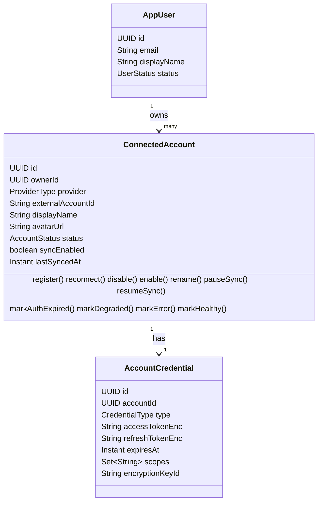

# F02 — Connected Accounts · Technical Design

> Mode: **TRAINING**. Trạng thái: DRAFT chờ Human review. Tương ứng 04D §5 (Domain Model), §7 (API — accounts), §9 (Security & Credential Boundary), §10 (account events), §14 (DoD F02).
> Convention chung ở `openspec/specs/` và design F01 đã archive (`openspec/changes/archive/2026-10-01-be-f01-project-foundation/design.md`); `ProviderType`, `ProviderRegistry`, `ProviderCredentials` ở `be-f03-provider-contract/design.md`.

## Context

- Nguồn: 01 FR-01, 02B (ERD, bảng `app_user`/`connected_account`/`account_credential`, account status, credential design, §12 retention), 02A §3 (Account module: "connected account, credential lifecycle, enable/disable, connection status"), 02A §11, 04A §5–6, 02C §8 (wording trạng thái cho UI).
- Conflict đã xử lý: **C4** — connect/OAuth flow thuộc F04; F02 chỉ chuẩn bị use case đăng ký kết nối để F04 gọi.
- Hiện trạng sau F01 (+ F03 nếu D-01 = A): có error model, security, Flyway V1, module convention, `ProviderRegistry`.
- Rủi ro kiến trúc đã biết từ khi inspect: `OAuth2AuthorizedClientService` của Spring Security lưu token theo `(clientRegistrationId, principalName)` → một người dùng chỉ giữ được **một** authorized client cho mỗi registration, tức không giữ được hai tài khoản Gmail. Vì vậy credential của Sino MUST do module account tự lưu (bảng `account_credential`), không dựa vào store đó. F04 dùng các thành phần cấp thấp của Spring OAuth2 Client (client registration, token response client) nhưng lưu vào store của Sino.

## Goals / Non-Goals

**Goals:**
- Aggregate `ConnectedAccount` với vòng đời trạng thái kiểm tra được bằng unit test thuần.
- Credential tách bảng, mã hóa đúng chuẩn, sẵn sàng xoay khóa, không lộ ra ngoài.
- Use case đăng ký/reconnect idempotent, cùng một transaction cho account + credential + event.
- REST API xem/sửa/xóa đủ cho màn hình Account Management của 02C (trừ Sync now/Connect).

**Non-Goals:** xem `proposal.md`.

## Decisions

### Owner và người dùng hiện tại

**D-10 — `app_user` thuộc module nào** · *Decision Needed (trước BE-09)*

| Phương án | Ưu | Nhược |
|---|---|---|
| **A. Module mới `identity`** (đề xuất) | Người dùng Sino ≠ tài khoản provider; login thật sau này (và tầm nhìn "Accounts" của Sino) có chỗ riêng; `account` chỉ biết `ownerId` (UUID) | Thêm một module so với danh sách của 04A → cần Human đồng ý (Proposal) |
| B. Trong module `account` | Ít package hơn, đúng danh sách 04A | `account` gánh hai khái niệm; khi làm login thật phải tách ra, sửa nhiều chỗ |

Với A: `identity` export interface `CurrentUser` (ví dụ `UUID requireOwnerId()`), sở hữu bảng `app_user`; `account` phụ thuộc `identity` qua interface đó. Với B: cùng interface nhưng nằm trong `account`.

Cách tạo owner (*Proposed default*): khi khởi động, một component đọc `sino.owner.email` / `sino.owner.display-name` (bắt buộc, validate) và **upsert idempotent** vào `app_user`. Ở MVP, mọi principal đã xác thực (D-02 A: một user API duy nhất) ánh xạ tới owner này. Phương án khác: seed bằng migration với UUID cố định — đơn giản nhưng nhét dữ liệu môi trường vào migration và khó đổi email.
*Câu hỏi cho bạn:* khi Sino có login thật cho nhiều người, phần nào của thiết kế này đổi và phần nào giữ nguyên?

### 5. Domain model



- `ConnectedAccount` là aggregate root; tham chiếu owner bằng ID (không có quan hệ JPA sang module khác).
- `AccountCredential` do module account sở hữu nhưng **không** nằm trong aggregate `ConnectedAccount` ở tầng domain: domain không bao giờ cầm ciphertext hay plaintext; credential chỉ đi qua credential store.
- Hành vi (`disable()`, `markAuthExpired()`...) nằm trong aggregate, không nằm rải rác ở service (tránh "anemic model"). Method trả về event cần publish hoặc để service publish — chọn một cách và ghi lại.

**D-12 — Tập trạng thái account** · *Decision Needed (trước BE-10)*

| Phương án | Mô tả | Ưu | Nhược |
|---|---|---|---|
| **A. Bỏ `SYNCING` khỏi trạng thái lưu** (đề xuất) | `CONNECTED`, `DEGRADED`, `AUTH_EXPIRED`, `DISABLED`, `ERROR`. "Đang sync" suy ra từ `sync_run` đang chạy (F07) | Trạng thái kết nối không lẫn với trạng thái tạm thời; crash giữa sync không để account kẹt ở `SYNCING`; ít xung đột ghi giữa sync và thao tác người dùng | Lệch 02B §9 và cần sửa lại 02B; UI "Syncing" (02C) phải lấy từ nguồn khác |
| B. Giữ nguyên 02B (6 trạng thái có `SYNCING`) | | Khớp tài liệu | Hai nguồn sự thật cho "đang sync"; cần cơ chế gỡ kẹt `SYNCING` |

Ngữ nghĩa giữ theo 02B (*Proposed default*): `DISABLED` = người dùng tắt account (không sync, bị loại khỏi inbox "active accounts" của FR-02); `syncEnabled` = false = chỉ tạm dừng **tự động** sync, account vẫn hiển thị.

Bảng chuyển trạng thái (phương án A; "—" = giữ nguyên, không event):

| Hiện tại ↓ / Sự kiện → | register/reconnect | disable (user) | enable (user) | authExpired (hệ thống) | degraded (hệ thống) | error (hệ thống) | healthy (hệ thống) |
|---|---|---|---|---|---|---|---|
| `CONNECTED` | `CONNECTED` | `DISABLED` | — | `AUTH_EXPIRED` | `DEGRADED` | `ERROR` | — |
| `DEGRADED` | `CONNECTED` | `DISABLED` | — | `AUTH_EXPIRED` | — | `ERROR` | `CONNECTED` |
| `AUTH_EXPIRED` | `CONNECTED` | `DISABLED` | — | — | — | — | — (chỉ reconnect mới gỡ) |
| `ERROR` | `CONNECTED` | `DISABLED` | — | `AUTH_EXPIRED` | `DEGRADED` | — | `CONNECTED` |
| `DISABLED` | `CONNECTED` | — | `CONNECTED` | — | — | — | — |

Sự kiện hệ thống chưa có caller cho tới F07; F02 cài chúng trong domain và kiểm bằng unit test vì chúng định nghĩa mô hình trạng thái.
*Câu hỏi cho bạn:* vì sao `AUTH_EXPIRED` không tự về `CONNECTED` khi sync sau đó thành công?

### Database (Flyway V2–V4)

**`app_user` (V2)** — `id uuid pk`, `email varchar(320) not null unique`, `display_name varchar(200) not null`, `status varchar(20) not null check (status in ('ACTIVE','DISABLED'))`, `created_at`, `updated_at timestamptz not null`.

**`connected_account` (V3)**

| Cột | Kiểu | Ràng buộc |
|---|---|---|
| `id` | `uuid` | PK (UUIDv7 sinh ở app, D-08) |
| `user_id` | `uuid` | not null, FK → `app_user(id)` |
| `provider` | `varchar(32)` | not null |
| `external_account_id` | `varchar(255)` | not null |
| `display_name` | `varchar(100)` | not null |
| `avatar_url` | `text` | null |
| `status` | `varchar(20)` | not null, `CHECK` theo D-12 (D-09) |
| `sync_enabled` | `boolean` | not null, default `true` |
| `last_synced_at` | `timestamptz` | null |
| `created_at`, `updated_at` | `timestamptz` | not null |
| `version` | `bigint` | not null (optimistic locking) |

`UNIQUE (user_id, provider, external_account_id)` (02B §4) — index này cũng phục vụ truy vấn "account của owner" (cột đầu là `user_id`).

**`account_credential` (V4)**

| Cột | Kiểu | Ràng buộc | So với 02B |
|---|---|---|---|
| `id` | `uuid` | PK | = |
| `account_id` | `uuid` | not null, **unique**, FK → `connected_account(id)` `ON DELETE CASCADE` | = (thêm unique cho quan hệ 1–1) |
| `credential_type` | `varchar(20)` | not null, `CHECK (credential_type in ('OAUTH2','TOKEN'))` | **thêm** |
| `access_token_enc` | `text` | not null | = |
| `refresh_token_enc` | `text` | null | = |
| `expires_at` | `timestamptz` | null | = |
| `scopes` | `jsonb` | not null, default `'[]'` (mảng chuỗi) | = |
| `encryption_key_id` | `varchar(32)` | not null | **thêm** |
| `created_at` | `timestamptz` | not null | **thêm** |
| `updated_at` | `timestamptz` | not null | = |
| `version` | `bigint` | not null | **thêm** |

**D-14 — Bổ sung cột cho `account_credential`** · *Decision Needed (trước BE-13)*: bốn cột **thêm** ở trên lệch 02B (04B Stop Condition: thay đổi data model). Lý do: `credential_type` cho provider không dùng OAuth (Telegram bot token — 00 nêu Telegram là provider 2); `encryption_key_id` bắt buộc cho xoay khóa (D-11); `created_at`/`version` theo convention F01. Nếu đồng ý → cập nhật 02B. *Câu hỏi cho bạn:* nếu bỏ `encryption_key_id`, bạn sẽ đổi khóa mã hóa thế nào khi đã có dữ liệu?

### 9. Security & Credential Boundary

**D-11 — Cách mã hóa credential** · *Decision Needed — Stop Condition của 04B (trước BE-12)*

| Phương án | Ưu | Nhược |
|---|---|---|
| **A. AES-256-GCM ở tầng ứng dụng (JCA) + key ring có ID** (đề xuất) | Không thêm dependency; mã hóa có xác thực (phát hiện sửa đổi); xoay khóa được nhờ `encryption_key_id`; khóa không bao giờ đi vào database | Tự viết ~1 class crypto → phải test kỹ và review bảo mật |
| B. `Encryptors.stronger(password, salt)` của Spring Security Crypto | Có sẵn trên classpath, ít code | Khóa suy ra từ password + salt; không có ID khóa → xoay khóa phải tự thiết kế thêm; ít minh bạch về tham số |
| C. `pgcrypto` trong PostgreSQL | Không có code crypto ở app | Khóa đi qua câu SQL → có thể lộ trong log/`pg_stat_statements`; mã hóa gắn chặt vào DB |
| D. KMS/Vault bên ngoài | Chuẩn production | Hạ tầng mới, ngoài stack được duyệt ở MVP |

Tham số cho phương án A (để review bảo mật; implement theo Level 2 ở tasks):
- Thuật toán `AES/GCM/NoPadding`, khóa 256-bit, IV 12 byte từ `SecureRandom` cho **mỗi** lần mã hóa, tag 128-bit.
- Associated data (AAD) = `account_id` + tên trường (ví dụ `access_token`) → ciphertext không chép được sang account/cột khác.
- Lưu trữ: `base64(IV ‖ ciphertext‖tag)` trong cột `*_enc`; ID khóa trong `encryption_key_id` (một khóa cho cả hàng).
- Cấu hình: `sino.credentials.encryption.active-key-id` + `sino.credentials.encryption.keys.<id>` (base64 của 32 byte), đọc từ env; validate khi khởi động (có khóa active, đúng 32 byte). Tạo khóa: `openssl rand -base64 32`.
- Test: khóa giả cố định trong `application-test.yaml` (không phải secret).
- Quy trình xoay khóa (ghi lại, chưa tự động hóa): thêm `k2` → đặt active = `k2` → mã hóa lại dần (job ở tương lai hoặc khi credential được ghi lại) → khi `select count(*) from account_credential where encryption_key_id = 'k1'` = 0 thì gỡ `k1`.
- Mất khóa = mất toàn bộ credential (người dùng phải connect lại). Khóa production cần được backup ngoài repo.

Nơi đặt: `account.infrastructure` (chỉ account dùng). Chuyển sang `common` khi có module thứ hai cần mã hóa.

**Ranh giới credential:**
- Credential store (nội bộ, `account.application`/`infrastructure`): `save` (mã hóa), `load` (giải mã → `ProviderCredentials` của F03, chỉ trong bộ nhớ), `delete`.
- F02 **không export** API đọc credential. F07 sẽ quyết định cách export cho `sync` — đề xuất một named interface riêng (ví dụ `account :: credentials`) để module dùng phải khai báo rõ trong `allowedDependencies`.
- `toString()` của mọi type chứa credential che giá trị; entity credential không bao giờ được map sang DTO; không bật log bind parameter của Hibernate.
- OAuth `state`, scope tối thiểu, revoke khi xóa: thuộc F04 (ghi nhận từ 02A §11 để không quên).

**D-15 — Ai refresh/rotate token** · *Decision Needed — Stop Condition của 04B (trước F04, không chặn F02)*

| Phương án | Mô tả |
|---|---|
| **A. Account điều phối, provider thực hiện** (đề xuất) | SPI có thêm thao tác refresh (F04); account service: giải mã → gọi refresh **ngoài transaction** → lưu token mới trong transaction → nếu thất bại `AUTH_EXPIRED`. Khớp 02A: account sở hữu "credential lifecycle" |
| B. Sync tự refresh khi gặp token hết hạn | Sync phải biết chi tiết credential → vi phạm ranh giới |
| C. `OAuth2AuthorizedClientManager` của Spring tự refresh | Vướng giới hạn một client mỗi registration mỗi principal (xem Context) |

F02 chỉ cần bảo đảm credential store có thao tác thay token (dùng cho reconnect), đủ cho F04 xây refresh.

### 7. API — accounts

| Method | Path | Body | Thành công | Lỗi |
|---|---|---|---|---|
| GET | `/api/accounts` | — | `200` mảng `AccountResponse` | 401 |
| GET | `/api/accounts/{id}` | — | `200` `AccountResponse` | 400 `MALFORMED_REQUEST`, 404 `ACCOUNT_NOT_FOUND` |
| PATCH | `/api/accounts/{id}` | `UpdateAccountRequest` | `200` `AccountResponse` | 400 `VALIDATION_FAILED`, 404, 409 `CONCURRENT_MODIFICATION` |
| DELETE | `/api/accounts/{id}` | — | `204` | 404 |

Chưa có: `POST /api/accounts/{provider}/connect` hoặc `/connect/{provider}` (F04, C5), `POST /api/accounts/{id}/sync` (F07).

```json
// AccountResponse
{
  "id": "01928c4e-7b1a-7cc0-9d1e-5c2f0f6a4b21",
  "provider": "gmail",
  "externalAccountId": "me@example.com",
  "displayName": "Gmail Personal",
  "avatarUrl": null,
  "status": "CONNECTED",
  "syncEnabled": true,
  "lastSyncedAt": null,
  "capabilities": ["READ_MESSAGES", "SEND_MESSAGES"],
  "createdAt": "2026-10-05T03:15:00Z",
  "updatedAt": "2026-10-05T03:15:00Z"
}

// UpdateAccountRequest — mọi trường tùy chọn, ít nhất một trường
{ "displayName": "Gmail Work", "syncEnabled": false, "enabled": true }
```

- `capabilities` lấy từ `ProviderRegistry` (capability tĩnh của provider, D-19). Nếu D-01 = B thì trường này thêm ở task nối sau F03.
- Collection nhỏ, không phân trang → trả mảng trực tiếp. Collection có phân trang (conversation, F05) dùng envelope `{ "items": [...], "nextCursor": ... }`.
- Không có trường nào của credential trong bất kỳ response nào; có test khẳng định điều này.

**D-13 — Ngữ nghĩa xóa account** · *Decision Needed (trước BE-17)*

| Phương án | Ưu | Nhược |
|---|---|---|
| **A. Xóa hẳn account + credential (cascade), publish `AccountRemoved`** (đề xuất cho F02) | Đơn giản; credential bị hủy ngay (an toàn); unique constraint không vướng khi connect lại | Mất dấu vết lịch sử; khi F05 có conversation phải chọn cách dọn dữ liệu phụ thuộc (listener hay FK cascade) |
| B. Xóa mềm (`removed_at`) | Giữ lịch sử/audit | Mọi truy vấn phải lọc; connect lại phải "hồi sinh" bản ghi; credential vẫn phải bị xóa riêng |

Việc giữ hay xóa lịch sử tin nhắn khi xóa account là **quyết định sản phẩm** ở F05 (02B §12); revoke token phía provider ở F04.
*Câu hỏi cho bạn:* nếu người dùng xóa account rồi kết nối lại đúng tài khoản đó, bạn muốn tin nhắn cũ quay lại không? Câu trả lời ảnh hưởng A/B thế nào?

### 10. Transactions & Events (account)

- `register` (tạo/reconnect): **một** transaction cho account + credential + event. Theo F01 §10, luồng connect của F04 gọi provider (đổi code, lấy profile) **trước** rồi mới gọi `register`.
- PATCH, DELETE: mỗi request một transaction; GET: `readOnly`.
- Optimistic locking (`version`) trên `connected_account` và `account_credential`; xung đột → `CONCURRENT_MODIFICATION` (409).
- Event (public type trong base package `dev.sino.account`):

| Event | Payload | Khi nào |
|---|---|---|
| `AccountConnected` | `accountId`, `ownerId`, `provider`, `reconnected`, `occurredAt` | register |
| `AccountStatusChanged` | `accountId`, `from`, `to`, `occurredAt` | mọi chuyển trạng thái thật (không phát khi no-op) |
| `AccountRemoved` | `accountId`, `ownerId`, `provider`, `occurredAt` | delete |

Chưa có listener; F02 kiểm tra việc publish bằng test module của Spring Modulith. `AccountConnected` sẽ kích hoạt initial sync ở F07.

### Error code catalog — bổ sung của F02

| code | HTTP | Nguồn |
|---|---|---|
| `ACCOUNT_NOT_FOUND` | 404 | Account không tồn tại hoặc thuộc người khác |
| `INVALID_ACCOUNT_STATE` | 409 | Chuyển trạng thái không hợp lệ (nội bộ; F02 chưa có REST nào gây ra) |

Lỗi giải mã credential là lỗi phía server → `INTERNAL_ERROR` (500), log rõ `accountId` và `encryption_key_id`, không log ciphertext.

### Testing (F02)

| Tầng | Nội dung |
|---|---|
| Unit | Bảng chuyển trạng thái (mọi ô), validation `displayName`, cipher (round-trip, IV khác nhau, sửa byte, sai AAD, sai khóa, xoay khóa, thiếu khóa) |
| JPA slice | Mapping V2–V4, unique `(user_id, provider, external_account_id)`, cascade xóa credential, cột `*_enc` không chứa plaintext (đọc bằng SQL thô) |
| Module | `register` tạo/reconnect idempotent; rollback khi lưu credential lỗi; event được publish với payload đúng; `UNKNOWN_PROVIDER` (dùng `FakeMessageProvider` của F03) |
| Web slice | 4 endpoint: 200/204/400/404/409/401; JSON không có trường credential |
| Full | Đăng ký qua use case → GET/PATCH/DELETE qua HTTP; log (output capture) không chứa token |

## Risks / Trade-offs

- [Tự viết crypto sai] → Chỉ dùng JCA chuẩn, tham số cố định ở trên, test tamper/AAD/rotation; review bảo mật riêng trước khi merge BE-12.
- [Mất hoặc lộ khóa] → Khóa chỉ ở env/secret store; không log; ghi rõ quy trình backup và xoay khóa.
- [Aggregate và credential lệch nhau (account không có credential)] → Tạo/xóa trong cùng transaction; FK + unique + cascade ở DB.
- [Trạng thái bị ghi đè giữa thao tác người dùng và sync] → Optimistic locking; quy tắc `DISABLED` không bị sự kiện hệ thống thay đổi.
- [Đoán trước nhu cầu của F04/F07] → Chỉ làm use case `register` + store; không làm refresh, không export API credential.
- [Thêm module `identity` (D-10 A) lệch 04A] → Là Proposal, chờ Human; nếu không đồng ý thì dùng B.

## Migration Plan

V2–V4 là migration tiến (forward-only). Ở local có thể reset bằng `docker compose down -v`. Sau khi merge vào `main`: mọi thay đổi schema là migration mới.

## Open Questions

- D-10, D-11, D-12, D-13, D-14: Decision Needed trước task tương ứng (bảng tổng ở F01 design).
- D-15: cần chốt trước F04.
- Cách export credential cho `sync` (F07); cách dọn dữ liệu phụ thuộc khi xóa account (F05).

## Definition of Done — F02

- [ ] Migration V2–V4 áp sạch trên DB trống; Hibernate validate xanh.
- [ ] Unit test phủ đủ bảng chuyển trạng thái và toàn bộ trường hợp của cipher.
- [ ] Module test cho `register` (mới, reconnect, provider không hỗ trợ, rollback) và event.
- [ ] Web test cho 4 endpoint, gồm cô lập owner (404) và không có trường credential trong JSON.
- [ ] Kiểm tra thủ công bằng psql: cột `access_token_enc` không chứa plaintext.
- [ ] App không start khi thiếu khóa mã hóa hoặc thiếu email owner.
- [ ] `ModularityTests` xanh: không module nào khác truy cập được credential store.
- [ ] `./mvnw verify` xanh; error catalog cập nhật.
- [ ] Learning gate: Human giải thích được AES-GCM + IV + AAD bảo vệ chống gì, quy trình xoay khóa, vì sao gọi provider phải nằm ngoài transaction, và bảng chuyển trạng thái.
- [ ] `tasks.md` tick đủ, chỗ lệch kế hoạch có ghi lý do; 02B được cập nhật nếu D-12/D-14 được chấp nhận; `PROJECT_STATE.md` cập nhật.
