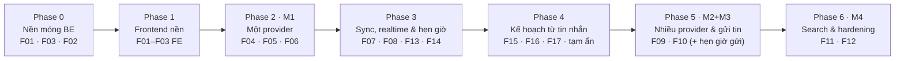

# Sino Messages — Lộ trình phát triển cho người code chính

> Mode **TRAINING**: bạn viết code, Claude mentor/review/test.
> Nguồn: Notion 03 (Feature Map, Dependency, Milestones M1–M4), 01, 02/02A/02B/02C, 04A và các change OpenSpec đã viết.
> Độ chi tiết giảm dần theo khoảng cách: **Phase 0** đã có task chi tiết; các phase sau là khung. Mỗi feature chỉ được viết spec chi tiết (một change OpenSpec) **khi bắt đầu làm nó**, để không lập kế hoạch cho thứ chưa hiểu rõ.
> Ước lượng kích thước (S = 1–2 buổi, M = 3–5 buổi, L = 6–10 buổi; một buổi ≈ 2–3 giờ) chỉ để định hướng và sẽ chỉnh sau khi xong F01.

---

## 1. Vòng lặp cho MỖI feature

Mỗi feature đi qua 5 bước. Không bỏ bước.

| Bước | Ai làm | Việc | Xong khi |
|---|---|---|---|
| **1. Spec** | Claude soạn, **bạn chốt** | Tạo change OpenSpec (proposal, specs, design, tasks). Bạn trả lời các mục *Decision Needed* | Bạn duyệt spec |
| **2. Code BE** | **Bạn** | Làm lần lượt từng task: code → `./mvnw verify` xanh → nhờ Claude review → sửa → commit | Mọi task BE được tick |
| **3. Code FE** (từ Phase 1) | **Bạn** | Nối màn hình với API vừa làm (vertical slice) | Luồng chạy được trên trình duyệt |
| **4. Nghiệm thu** | Bạn + Claude | Checklist Definition of Done + **learning gate** (bạn tự giải thích luồng, trade-off, rủi ro) + demo | DoD đạt, bạn trả lời được câu hỏi của learning gate |
| **5. Đóng** | Claude hỗ trợ | Archive change (`openspec archive <change> -y`), cập nhật `PROJECT_STATE.md` và Notion, mở PR vào `main` (**hỏi trước**) | Change đã archive, PR đã merge |

Quy ước nhánh (Notion 03): `feature/be-fXX-...`, `feature/fe-fXX-...`. Mỗi task là một commit; mỗi feature là một PR.

Khi code một task, bạn có thể xin trợ giúp theo mức: **Level 1** gợi ý → **Level 2** hướng đi → **Level 3** pseudocode → **Level 4** code tham khảo (chỉ khi bạn yêu cầu rõ).

---

## 2. Tổng quan các phase

| Phase | Feature | Demo được khi xong | Milestone Notion | Kích thước |
|---|---|---|---|---|
| **0 — Nền móng BE** | F01, F03, F02 (thứ tự theo D-01) | Gọi bằng curl: health, danh sách provider, CRUD account với fake provider; credential được mã hóa trong DB | — | ~L+M+L |
| **1 — Frontend nền** | F01-FE, F02-FE, F03-FE | Mở web: khung app 3 cột, trang Accounts đọc/sửa/xóa account thật từ API | — | ~M |
| **2 — Một provider** | F04, F05, F06 | Kết nối Gmail thật → thấy Unified Inbox → mở conversation đọc lịch sử | **M1 Single-provider proof** | ~L+L+M |
| **3 — Sync, realtime & hẹn giờ** | F07, F08, F13, F14 | Mail mới tự xuất hiện trên web không cần reload; lỗi sync hiện đúng account; việc hẹn giờ chạy đúng giờ, thông báo trong app và Web Push | một phần M3 | ~L+M+M+M |
| **4 — Kế hoạch từ tin nhắn** | F15, F16, F17, tạm ẩn | Từ một thư: tạo task có nhắc nhở, ghi chú, lịch hẹn; tạm ẩn cuộc trò chuyện; nhận nhắc nhở khi tab đã đóng | — (mở rộng, Conflict C9) | ~S+L+M+S |
| **5 — Nhiều provider & gửi tin** | F09, F10 (+ hẹn giờ gửi) | Hai provider trong một inbox; trả lời tin từ Sino; hẹn giờ gửi thư | **M2** + phần còn lại của **M3** | ~L+M |
| **6 — Search & hardening** | F11, F12 | Tìm kiếm tin nhắn; retry/rate-limit/quan sát hệ thống; xoay khóa mã hóa | **M4 Production-style hardening** | ~M+L |

> **Mở rộng phạm vi (2026-10-02):** Phase 4 và F13, F14, hẹn giờ gửi không có trong Notion 01/03; chủ sản phẩm quyết định thêm. Hồ sơ phạm vi và quyết định D-25…D-31: `openspec/changes/planner-from-messages`. Canvas thiết kế "Sino UI" cũng có màn vượt MVP (Tổng quan, Dịch vụ, Đăng ký, Onboarding) — cần đưa vào Notion hoặc đánh dấu là ý tưởng sau MVP.

Luật từ Notion 03: F01–F03 làm **BE trước**; từ F04 trở đi mỗi feature là một **vertical slice** gồm cả BE lẫn FE. Không làm hết BE rồi mới làm FE.

---

## 3. Chi tiết từng phase và feature

### Phase 0 — Nền móng backend (đang làm)

Mục tiêu: backend có nền móng vững, contract provider rõ, account được lưu an toàn. Chưa có provider thật, chưa có frontend.

#### F01 — Project Foundation · ✅ DONE 2026-10-01 · `openspec/changes/archive/2026-10-01-be-f01-project-foundation` · ~L

| Bước code | Task | Bạn sẽ học |
|---|---|---|
| 0.1 Môi trường | BE-01 Compose + Postgres 18 | Docker Compose, volume, healthcheck |
| 0.2 Chạy được trên DB thật | BE-02 profile + Flyway V1 | Spring profiles, env/secret, Flyway, JPA `validate`, Modulith event table |
| 0.3 Luật chơi chung | BE-03 ModularityTests · BE-04 Security · BE-05 Problem Details | Spring Modulith, Security filter chain, RFC 9457, `@RestControllerAdvice` |
| 0.4 Vận hành | BE-06 Actuator · BE-07 CI | liveness/readiness, log an toàn, GitHub Actions |
| 0.5 Đóng | BE-08 README + nghiệm thu | Viết tài liệu chạy được |

Cần chốt: **D-03** trước BE-03, **D-02** trước BE-04.

#### F03 — Provider Contract · ✅ DONE 2026-10-03 · `openspec/changes/archive/2026-10-03-be-f03-provider-contract` · ~M

| Bước code | Task | Bạn sẽ học |
|---|---|---|
| Từ vựng | BE-19 ProviderType + capability | value object, record, `EnumSet` bất biến |
| Contract dữ liệu | BE-20 kiểu chuẩn hóa · BE-21 SPI · BE-22 lỗi provider | thiết kế interface, sealed type, validation trong record, che secret |
| Registry & kiểm chứng | BE-23 registry · BE-24 contract test kit · BE-25 `GET /api/providers` | fail-fast khi start, abstract contract test, ArchUnit |
| Đóng | BE-26 nghiệm thu | |

Cần chốt: **D-01** (đề xuất làm F03 trước F02), **D-16**, **D-18**.

#### F02 — Connected Accounts · ✅ DONE 2026-10-07 · `openspec/changes/archive/2026-10-07-be-f02-connected-accounts` · ~L

| Bước code | Task | Bạn sẽ học |
|---|---|---|
| Chủ sở hữu | BE-09 `app_user` + `CurrentUser` | `@ConfigurationProperties` có validate, idempotent startup |
| Domain & persistence | BE-10 aggregate + state machine · BE-11 V3 + JPA | aggregate, bảng chuyển trạng thái, parameterized test, optimistic locking |
| Credential | BE-12 AES-GCM · BE-13 V4 + credential store | mã hóa có xác thực, IV/AAD, xoay khóa, `jsonb` |
| Use case | BE-14 register/reconnect + event | transaction boundary, Modulith event + module test |
| REST | BE-15 GET · BE-16 PATCH · BE-17 DELETE | thiết kế REST, ngữ nghĩa PATCH, 404 vs 403, xử lý xung đột |
| Đóng | BE-18 E2E + chống lộ secret | |

~~Cần chốt: **D-10**, **D-11**, **D-12**, **D-13**, **D-14**.~~ Đã chốt: D-10 = A, D-11 = A, D-12 = A, D-13 = B (xóa mềm), D-14 = thêm cột.

**Kết thúc Phase 0:** PR `feature/be-f01-f03-plan` + các nhánh BE vào `main`, archive 3 change, cập nhật Notion 04C/04D.

---

### Phase 1 — Frontend nền (vertical slice cho F01–F03) · ~M

Mục tiêu: có web app thật gọi API thật, để từ Phase 2 mỗi feature đều có cả FE.

| Feature | FE | Việc nhỏ ở BE |
|---|---|---|
| F01-FE | Cài stack FE đã chọn (React Router, TanStack Query, Tailwind, shadcn/ui) vào `apps/sino-web`; `AppShell` 3 cột (02C §2, §12); route theo 02C §11; API client có kiểu; xử lý Problem Details | Vite dev proxy `/api` → `localhost:8080` (tránh CORS khi dev) |
| F02-FE | Trang Accounts (02C §8): danh sách, badge trạng thái với wording dễ hiểu ("Needs login again"...), đổi tên, tắt/bật, xóa | — |
| F03-FE | Provider card + badge capability (02C §5); tiện ích "chỉ hiện hành động khi provider hỗ trợ" | — |

**Quyết định mở phase — D-22: xác thực cho trình duyệt.** HTTP Basic (D-02) không hợp với SPA (phải giữ mật khẩu trong JS) và với SSE (`EventSource` không gửi được header). Các phương án sẽ so sánh khi mở phase: session cookie + CSRF token (form/JSON login), hoặc OAuth2 login bằng Google, hoặc token ngắn hạn. Phải chốt trước khi FE gọi API thật, và chắc chắn trước F08.

Bạn sẽ học: TanStack Query (cache, invalidation), React Router, typed API client, xử lý lỗi ở FE, cookie/CSRF trong SPA.

---

### Phase 2 — Một provider hoàn chỉnh (M1 Single-provider proof)

#### F04 — Gmail connector + luồng Connect · ~L (feature lớn nhất)

- **BE:** luồng OAuth2 authorization code (tạo URL + `state` → Google → callback kiểm tra `state` → đổi code lấy token → `getAccountProfile` → use case `register` của F02); connector Gmail implement SPI F03 (profile, `fetchUpdates` bằng Gmail API, chuẩn hóa thread/message/MIME); refresh token theo D-15; connector vượt contract test kit.
- **FE:** nút "Add account → Gmail", màn hình kết quả connect (thành công/lỗi có hướng dẫn).
- **Cần chốt khi mở spec:** D-15 (ai refresh token); đường dẫn endpoint connect (C5); **scope tối thiểu**; cursor = Gmail `historyId`?; cửa sổ initial sync; công cụ giả lập HTTP cho test.
- **Rủi ro cần biết sớm:** scope đọc Gmail thuộc nhóm *restricted* của Google. App dùng cá nhân phải để OAuth consent ở chế độ **Testing** với danh sách test user; đưa lên production cần Google thẩm định bảo mật. Chuẩn bị Google Cloud project trước khi bắt đầu.
- **Bạn sẽ học:** OAuth2 authorization code, chống CSRF bằng `state`, Spring OAuth2 Client ở mức thấp (vì giới hạn multi-account, xem F02 design), `RestClient`, Gmail API, parse MIME, test connector bằng HTTP giả lập.

#### F05 — Unified Inbox · ~L

- **BE:** module `conversation`; bảng `conversation`, `conversation_participant` (02B); **nhập dữ liệu ban đầu tối thiểu** để inbox có dữ liệu trước khi có F07 (gọi `fetchUpdates` và upsert idempotent theo unique constraint — cách kích hoạt chốt khi mở spec); `GET /api/conversations` lọc theo account/provider/unread, phân trang bằng cursor, sắp theo `last_message_at`; `GET/PATCH /api/conversations/{id}` (star/archive).
- **FE:** danh sách conversation ở cột giữa, infinite scroll, badge provider/account, unread (02C §6).
- **Cần chốt:** quyết định sản phẩm khi xóa account thì giữ hay xóa lịch sử (02B §12, D-13); cách dọn dữ liệu phụ thuộc (listener hay FK cascade).
- **Bạn sẽ học:** keyset/cursor pagination, index (02B §5), upsert `ON CONFLICT` so với JPA, projection, `EXPLAIN ANALYZE`.

#### F06 — Message History · ~M

- **BE:** module `messaging`; bảng `message`, `attachment`; luồng upsert message và cập nhật preview/unread (02B §11); `GET /api/conversations/{id}/messages?before=&limit=` (mới nhất trước).
- **FE:** cột phải: timeline, bubble inbound/outbound, metadata attachment, cuộn lên để tải tin cũ hơn.
- **Cần chốt:** lưu và hiển thị nội dung email HTML thế nào (plain text hay HTML đã sanitize) — liên quan trực tiếp tới **XSS**.
- **Bạn sẽ học:** phân trang ngược, sanitize nội dung không tin cậy, quan hệ aggregate giữa conversation và message.

**Kết thúc Phase 2 = M1:** demo kết nối Gmail thật → inbox → đọc thread.

---

### Phase 3 — Sync nền, realtime & hẹn giờ

#### F07 — Sync Engine · ~L

- **BE:** module `sync`; bảng `sync_checkpoint`, `sync_run` (02B); scheduler; **khóa theo account** để một account không bị sync song song; sync tăng dần theo cursor, chỉ tiến checkpoint sau khi lưu thành công (02A §7); retry có backoff cho `RATE_LIMITED`/`PROVIDER_UNAVAILABLE`; chuyển trạng thái account (`AUTH_EXPIRED`, `DEGRADED`...); listener `AccountConnected` → initial sync; `POST /api/accounts/{id}/sync`; event `AccountSync*`; export credential cho `sync` qua named interface riêng (F02 đã để ngỏ).
- **FE:** trạng thái sync/lỗi theo từng account, nút "Sync now" (02C §8, §15).
- **Bạn sẽ học:** job nền, idempotency khi chạy đồng thời, khóa trong PostgreSQL (advisory lock / `SKIP LOCKED`), backoff, listener tin cậy nhờ Event Publication Registry.

#### F08 — Realtime (SSE) · ~M

- **BE:** module `realtime`; `GET /api/events/stream` (SSE); nghe event message/conversation → đẩy envelope chung (02C §14), không đẩy payload thô; heartbeat; xử lý client ngắt kết nối.
- **FE:** handler SSE cập nhật/invalidate cache TanStack Query.
- **Phụ thuộc:** D-22 đã chốt (xác thực cho `EventSource`).
- **Bạn sẽ học:** SSE, async request trong Servlet stack, giới hạn kết nối, chiến lược reconnect.

#### F13 — Scheduler · ~M

- **BE:** module `scheduler`; bảng `scheduled_job` (loại, giờ chạy, tham chiếu loại + ID, trạng thái, số lần thử, lỗi gần nhất, lease); worker quét ~15 giây bằng `FOR UPDATE SKIP LOCKED`; thử lại 1/5/15 phút và theo `retryAfter`; chạy bù sau sự cố; SPI `ScheduledJobHandler` cho module sở hữu; event `ScheduledJobFailed`.
- **FE:** không có màn riêng.
- **Cần chốt khi mở spec:** **D-30** tự viết hay dùng thư viện (db-scheduler/JobRunr); **D-31** cách gọi module sở hữu; làm trước hay sau F07 (F07 có thể dùng chung bảng này).
- **Bạn sẽ học:** khóa hàng trong PostgreSQL, lease, idempotency của tác động phụ, test có `Clock` tua giờ, test song song bằng Testcontainers.

#### F14 — Thông báo · ~M

- **BE:** module `notification`; bảng `notification` (chống trùng bằng `dedup_key`), `push_subscription` (WEB/IOS/ANDROID); Web Push chuẩn (VAPID, khóa trong `.env`); gửi push trong listener sau commit; 404/410 → xóa thiết bị; `realtime` đẩy `NotificationCreated` qua SSE.
- **FE:** chuông + trung tâm thông báo; service worker nhận push; Cài đặt → bật thông báo, danh sách thiết bị.
- **Cần chốt khi mở spec:** thư viện Web Push cho Java 25; nội dung push (chỉ tiêu đề + đường dẫn).
- **Phụ thuộc:** F13, F08, D-22.
- **Bạn sẽ học:** Web Push (RFC 8030/8291/8292), service worker, listener tin cậy với Event Publication Registry, bảo vệ dữ liệu khi đi qua dịch vụ bên thứ ba.

---

### Phase 4 — Kế hoạch từ tin nhắn

Mục tiêu: biến tin nhắn thành việc cần làm, ghi chú, lịch hẹn; mọi thứ nằm trong Sino (D-25), nhắc nhở chỉ qua Sino (D-26). Hồ sơ phạm vi: `openspec/changes/planner-from-messages`.

#### F15 — Ghi chú · ~S

- **BE:** module `notes`; bảng `note` (≤ 20.000 ký tự, ghim, neo MESSAGE/CONVERSATION/PARTICIPANT theo loại + ID, `context_conversation_id`); tìm bằng `ILIKE` (FTS khi có F11).
- **FE:** trang Ghi chú; panel "Việc và ghi chú" trong cuộc trò chuyện; bôi đen đoạn tin → Ghi chú.
- **Bạn sẽ học:** tham chiếu chéo module không dùng khóa ngoại, xử lý tham chiếu mồ côi.

#### F16 — Việc cần làm + nhắc nhở · ~L

- **BE:** module `planner`; bảng `task`, `recurrence`, `reminder`; "Nhắc tôi" = task "Trả lời: …" có nhắc nhở; task lặp tạo lần kế tiếp khi Xong; nhắc nhở chạy qua F13, báo qua F14 (Xong / Nhắc lại sau 1 giờ).
- **FE:** trang Việc cần làm (Quá hạn/Hôm nay/Sắp tới/Không có hạn/Đã xong); menu trên tin nhắn: Tạo task, Nhắc tôi.
- **Bạn sẽ học:** quy tắc lặp và múi giờ (`ZonedDateTime`), test dạng bảng, các ca biên của lịch (ngày 31, 29/02).

#### F17 — Lịch · ~M

- **BE:** bảng `event` (dùng lại `recurrence`, `reminder`); `GET /api/calendar?from=&to=` gộp lịch hẹn, task có hạn, nhắc nhở; lần lặp tính khi xem, không lưu sẵn.
- **FE:** màn Lịch (Tuần/Tháng/Lịch trình); menu trên tin nhắn: Lịch hẹn.
- **Bạn sẽ học:** truy vấn theo khoảng thời gian giao nhau, sinh lần lặp trong một cửa sổ.

#### Tạm ẩn cuộc trò chuyện (mở rộng F05) · ~S

- **BE:** `conversation.snoozed_until`, `resurfaced_at`; việc `UNSNOOZE` qua F13; tin mới bỏ tạm ẩn ngay.
- **FE:** nút Tạm ẩn, bộ lọc "Đang tạm ẩn", dấu "Hiện lại theo hẹn".

---

### Phase 5 — Nhiều provider & gửi tin (M2 + M3)

#### F09 — Provider thứ hai · ~L

- **Quyết định lớn khi mở spec:** chọn provider nào (00: Telegram hoặc provider có API phù hợp). Với Telegram: **Bot API** chỉ thấy chat với bot, không đọc được tin cá nhân của người dùng; **MTProto/TDLib** đọc được tin cá nhân nhưng phức tạp hơn nhiều (đăng nhập bằng số điện thoại, session). Chọn sai thì không chứng minh được mục tiêu "unified".
- **BE:** connector thứ hai, credential loại `TOKEN` (D-14), capability khác Gmail → đây là bài kiểm tra thật của contract F03 (nếu phải sửa core → contract có vấn đề, ghi lại).
- **FE:** badge/filter đa provider.
- **Bạn sẽ học:** đánh giá API bên thứ ba, giữ core không đổi khi thêm provider.

#### F10 — Send Message · ~M

- **BE:** `POST /api/conversations/{id}/messages`; kiểm tra capability trước khi gửi (FR-06); **idempotency key** chống gửi trùng khi retry; message outbound `PENDING → SENT/FAILED`; map `ProviderException` ra HTTP; Gmail send (MIME, header threading `In-Reply-To`/`References`); event `MessageSent`.
- **FE:** composer tự ẩn/disable theo capability (02C §7), optimistic UI.
- **Hẹn giờ gửi (mở rộng, xem `planner-from-messages`):** thư đi ở `SCHEDULED` → `SENDING` → `SENT`/`FAILED`; việc `SEND_MESSAGE` qua F13; sửa/hủy trước giờ gửi; lần chạy lại gặp `SENDING` thì không gửi mù; lỗi → thông báo qua F14. FE: Gửi ▾ → Gửi lúc…, bộ lọc "Đã hẹn giờ".
- **Bạn sẽ học:** idempotency cho lệnh không idempotent, thiết kế lỗi cho thao tác gọi hệ thống ngoài.

---

### Phase 6 — Search & hardening (M4)

#### F11 — Search · ~M

- **BE:** module `search`; PostgreSQL Full Text Search + GIN index (02B §5); `GET /api/search` lọc provider/account/thời gian; phân trang; highlight.
- **Cần chốt:** tìm kiếm tiếng Việt không dấu (extension `unaccent`?), cấu hình `simple` hay khác.
- **FE:** trang Search (02C §9).
- **Bạn sẽ học:** FTS, GIN, đọc query plan.

#### F12 — Hardening · ~L

- Rate limit và retry cho lời gọi provider; structured logging + MDC `accountId`/`provider`; metrics cho sync; job mã hóa lại credential khi xoay khóa (D-11); dọn `sync_run` theo retention; rà soát bảo mật theo OWASP API Top 10; UX reconnect/lỗi.
- **Bạn sẽ học:** vận hành hệ thống thật: quan sát, giới hạn, phục hồi.

---

## 4. Các điểm quyết định theo thời gian

| Khi nào | Quyết định |
|---|---|
| Trước BE-03 / BE-04 | D-03, D-02 |
| Trước F02 | D-01, D-10, D-11, D-12, D-13, D-14 |
| Trước F03 | D-16, D-18 |
| Mở Phase 1 | **D-22** xác thực cho trình duyệt |
| Mở F04 | D-15, endpoint connect (C5), scope Gmail, công cụ giả lập HTTP |
| Mở F05 | Giữ/xóa lịch sử khi xóa account; cách kích hoạt nhập dữ liệu ban đầu |
| Mở F06 | Lưu/hiển thị HTML email (XSS) |
| Mở Phase 3 | Thứ tự F07 / F13 |
| Mở F13 | **D-30** scheduler tự viết hay thư viện, **D-31** cách gọi module sở hữu |
| Mở F14 | Thư viện Web Push |
| Mở F10 | "Gửi lại" sau khi thư hẹn giờ thất bại: gửi ngay hay mở lại ô soạn |
| Mở F09 | Chọn provider thứ hai và cách tích hợp |
| Mở F11 | Tìm kiếm tiếng Việt không dấu |

## 5. Vị trí hiện tại

- **Phase 0:** code xong: F01 (2026-10-01), F03 (2026-10-03), F02 (2026-10-07), cả ba đã archive, trên nhánh `dev`. Để đóng phase còn: đưa `dev` vào `main` (người dùng quyết định, hỏi trước khi merge/push/PR) và cập nhật Notion (02B theo D-12/D-13/D-14, 04C/04D).
- **Tiếp theo:** Phase 1 (frontend), mở bằng quyết định **D-22** (xác thực cho trình duyệt).
- `PROJECT_STATE.md` là nơi ghi trạng thái thật; file này chỉ là bản đồ và được cập nhật khi xong mỗi phase.
